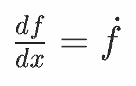

# latypst

An experimental tool to convert LaTeX math to Typst math

## Overview

[Typst](https://typst.app/) is a great typesetting software, but they decided to make the math markup not compatible with LaTeX's.
It is fine as a brand new typesetting program, but sometimes I would like to convert existing LaTeX documents to Typst, and while most of the document structure is straightforward to convert, math is not so easy.
However, the conversion is almost (90%) mechanical replacement, so I thought it should be automated.

This project is an attempt to make such an automatic converter and a hope that I can learn about LaTeX and Typst syntax deeper.
As this project's scope is so narrow, a complete document-wide conversion is not the goal.
If it works for a math between $ symbols, this project would achieve the goal.

## Example

Command:

```
echo '$\frac{df}{dx} = \dot{f}$' | cargo r; typst compile out.typ
```

Output:


